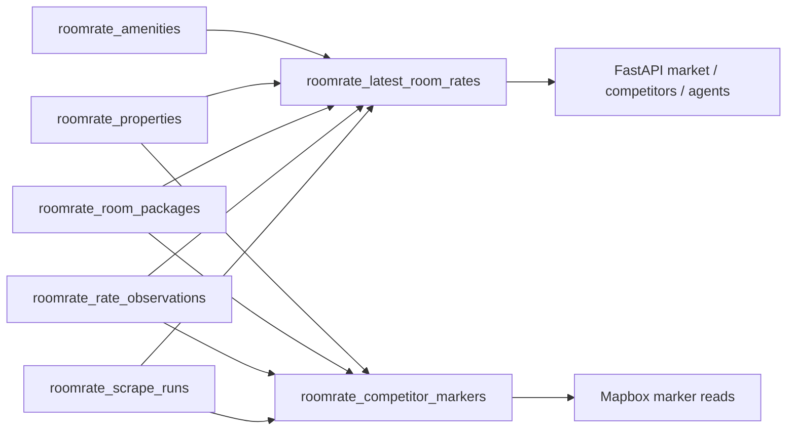
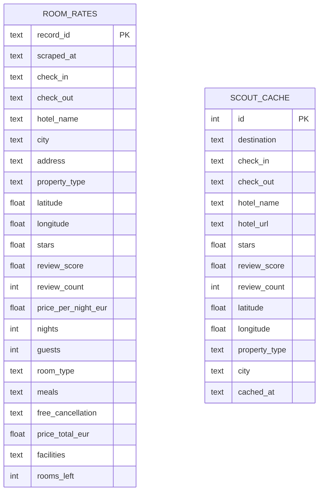

# RoomRate - ERD Βάσης Δεδομένων

**Τελευταία ενημέρωση:** 2026-05-16  
**Τρέχον Alembic head:** `20260517_0004`  
**Πεδίο κάλυψης:** normalized production schema του RoomRate μαζί με το multi-tenant layer. Τα legacy tables υπάρχουν στο τέλος ως ιστορικό/rollback κομμάτι.
**Αναλυτικό PNG:** `output/erd/roomrate_erd_detailed_el.png`

---

## 1. Κεντρικό ERD

```mermaid
erDiagram
    ROOMRATE_ACCOUNTS ||--o{ ROOMRATE_MEMBERSHIPS : έχει
    ROOMRATE_USER_IDENTITIES ||--o{ ROOMRATE_MEMBERSHIPS : συνδέεται
    ROOMRATE_ACCOUNTS ||--o{ ROOMRATE_OWNED_PROPERTIES : κατέχει
    ROOMRATE_PROPERTIES ||--o{ ROOMRATE_OWNED_PROPERTIES : ταιριάζει
    ROOMRATE_ACCOUNTS ||--o{ ROOMRATE_SCRAPE_JOBS : ζητά
    ROOMRATE_OWNED_PROPERTIES ||--o{ ROOMRATE_SCRAPE_JOBS : ρυθμίζει
    ROOMRATE_SCRAPE_JOBS ||--o{ ROOMRATE_SCRAPE_RUNS : εκτελείται
    ROOMRATE_ACCOUNTS ||--o{ ROOMRATE_SCRAPE_RUNS : περιορίζει
    ROOMRATE_SCRAPE_RUNS ||--o{ ROOMRATE_RATE_OBSERVATIONS : περιέχει
    ROOMRATE_PROPERTIES ||--o{ ROOMRATE_RATE_OBSERVATIONS : παρατηρείται
    ROOMRATE_RATE_OBSERVATIONS ||--o{ ROOMRATE_ROOM_PACKAGES : έχει
    ROOMRATE_SCRAPE_RUNS ||--o{ ROOMRATE_RAW_INGESTION_EVENTS : καταγράφει
    ROOMRATE_PROPERTIES ||--o{ ROOMRATE_PROPERTY_AMENITIES : έχει
    ROOMRATE_AMENITIES ||--o{ ROOMRATE_PROPERTY_AMENITIES : χαρακτηρίζει

    ROOMRATE_ACCOUNTS {
        uuid id PK
        string slug UK
        string display_name
        string status
        timestamptz created_at
        timestamptz updated_at
    }

    ROOMRATE_USER_IDENTITIES {
        uuid id PK
        string auth_provider
        string auth_subject
        string email
        string display_name
        boolean is_active
        timestamptz created_at
        timestamptz updated_at
    }

    ROOMRATE_MEMBERSHIPS {
        uuid id PK
        uuid account_id FK
        uuid user_id FK
        string role
        timestamptz created_at
        timestamptz updated_at
    }

    ROOMRATE_OWNED_PROPERTIES {
        uuid id PK
        uuid account_id FK
        uuid matched_property_id FK
        string display_name
        text booking_url
        text address
        string city
        string country
        string property_type
        numeric latitude
        numeric longitude
        string location_source
        numeric location_confidence
        boolean is_active
        timestamptz created_at
        timestamptz updated_at
    }

    ROOMRATE_SCRAPE_JOBS {
        uuid id PK
        uuid account_id FK
        uuid owned_property_id FK
        string destination
        date check_in
        date check_out
        int adults
        int children
        int rooms
        string status
        timestamptz requested_at
        timestamptz started_at
        timestamptz finished_at
        text error_message
        timestamptz created_at
        timestamptz updated_at
    }

    ROOMRATE_SCRAPE_RUNS {
        uuid id PK
        uuid account_id FK
        uuid scrape_job_id FK
        string provider
        string source_run_key
        string source_run_id
        string destination
        date check_in
        date check_out
        int nights
        int guests
        int adults
        int children
        int rooms
        string status
        timestamptz started_at
        timestamptz finished_at
        jsonb raw_metadata
        timestamptz created_at
        timestamptz updated_at
    }

    ROOMRATE_PROPERTIES {
        uuid id PK
        string provider
        string source_property_key
        string canonical_name
        string display_name
        string city
        string country
        text address
        string property_type
        numeric latitude
        numeric longitude
        numeric stars
        timestamptz created_at
        timestamptz updated_at
    }

    ROOMRATE_RATE_OBSERVATIONS {
        uuid id PK
        uuid scrape_run_id FK
        uuid property_id FK
        timestamptz observed_at
        numeric review_score
        int review_count
        int rooms_left_min
        numeric price_min_eur
        numeric price_max_eur
        timestamptz created_at
        timestamptz updated_at
    }

    ROOMRATE_ROOM_PACKAGES {
        uuid id PK
        uuid rate_observation_id FK
        string source_record_id
        string room_type
        text meals
        string free_cancellation
        numeric price_per_night_eur
        numeric price_total_eur
        int rooms_left
        jsonb package_payload
        timestamptz created_at
        timestamptz updated_at
    }

    ROOMRATE_AMENITIES {
        uuid id PK
        string name
        string normalized_name UK
        timestamptz created_at
        timestamptz updated_at
    }

    ROOMRATE_PROPERTY_AMENITIES {
        uuid property_id PK,FK
        uuid amenity_id PK,FK
        timestamptz created_at
        timestamptz updated_at
    }

    ROOMRATE_RAW_INGESTION_EVENTS {
        uuid id PK
        uuid scrape_run_id FK
        string source
        string source_run_id
        string payload_hash UK
        timestamptz captured_at
        jsonb payload
        timestamptz created_at
        timestamptz updated_at
    }
```



---

## 2. Πώς διαβάζεται πρακτικά το schema

### Multi-tenant / SaaS layer

| Πίνακας | Ρόλος |
|---|---|
| `roomrate_accounts` | Ένας πελάτης/operator/company account. |
| `roomrate_user_identities` | Ταυτότητα login από εξωτερικό auth provider, π.χ. Supabase, Clerk ή Auth0. |
| `roomrate_memberships` | Συνδέει users με accounts και κρατά ρόλο, π.χ. owner/admin/member. |
| `roomrate_owned_properties` | Τα καταλύματα του χρήστη/account, μαζί με Booking URL, περιοχή, lat/lng και optional link (`matched_property_id`) προς το canonical Booking property. |
| `roomrate_scrape_jobs` | Το αίτημα scrape που θα δημιουργεί το frontend για συγκεκριμένο account/property. |

### Market intelligence layer

| Πίνακας | Ρόλος |
|---|---|
| `roomrate_scrape_runs` | Ένα πραγματικό executed scrape, scoped με `account_id`, linked προαιρετικά με `scrape_job_id`, και με adults/children/rooms για συγκρίσιμα market snapshots. |
| `roomrate_properties` | Global διάσταση ανταγωνιστικών καταλυμάτων από Booking.com data. Δεν ανήκει σε έναν μόνο πελάτη. |
| `roomrate_rate_observations` | Η κατάσταση ενός property μέσα σε ένα scrape run: reviews, min/max price, rooms left. |
| `roomrate_room_packages` | Room/package-level offers: δωμάτιο, πακέτο, τιμή, cancellation, availability. |
| `roomrate_amenities` | Καθαρισμένες παροχές/amenities, deduplicated με normalized name. |
| `roomrate_property_amenities` | Many-to-many σύνδεση property με amenities. |
| `roomrate_raw_ingestion_events` | Raw payload storage για debugging, audit και replay του scraper. |

---

## 3. Σημαντικά constraints και indexes

| Περιοχή | Constraint / Index | Γιατί είναι σημαντικό |
|---|---|---|
| Accounts | `uq_roomrate_accounts_slug` | Κάθε account έχει μοναδικό slug. |
| Users | `uq_roomrate_user_identities_provider_subject` | Κάθε external auth user μπαίνει μία φορά. |
| Memberships | `uq_roomrate_memberships_account_user` | Αποφεύγει διπλές εγγραφές του ίδιου user στο ίδιο account. |
| Scrape runs | `uq_roomrate_scrape_runs_account_provider_source_key` | Το ίδιο provider run key μπορεί να υπάρχει ανεξάρτητα για διαφορετικά accounts. |
| Scrape runs | `ix_roomrate_scrape_runs_market_dates` | Γρήγορο filtering ανά account, destination, check-in/check-out, adults, children και rooms. |
| Properties | `uq_roomrate_properties_provider_source_key` | Κρατά μία canonical εγγραφή ανά Booking.com property. |
| Observations | `uq_roomrate_rate_observations_run_property` | Ένα observation ανά property μέσα στο ίδιο scrape run. |
| Packages | `uq_roomrate_room_packages_observation_record` | Idempotent writes για room packages. |
| Amenities | `uq_roomrate_amenities_normalized_name` | Deduplication amenities, π.χ. WiFi/wifi/Δωρεάν WiFi όπου γίνεται normalization. |
| Raw events | `uq_roomrate_raw_ingestion_events_payload_hash` | Δεν αποθηκεύεται το ίδιο raw payload πολλές φορές. |

---

## 4. Views που χρησιμοποιεί το API



| View | Ρόλος |
|---|---|
| `roomrate_latest_room_rates` | Compatibility/read view που μοιάζει με το παλιό `room_rates`, αλλά έχει `account_id` και occupancy fields. Από το `20260510_0003` κρατά μόνο το τελευταίο completed scrape ανά account/destination/dates/adults/children/rooms. |
| `roomrate_competitor_markers` | Έτοιμη βάση για Mapbox markers ανά account, property, destination, dates και occupancy, επίσης περιορισμένη στο latest completed scrape. |

Το repository διαβάζει από `roomrate_latest_room_rates` όταν ισχύει:

```env
ROOMRATE_RATE_SOURCE=normalized
```

---

## 5. Legacy tables

Οι παρακάτω πίνακες υπάρχουν ακόμα για rollback/backward compatibility. Δεν είναι το προτεινόμενο production read model για το SaaS.



Προτεινόμενη κατεύθυνση: το `room_rates` να μείνει προσωρινά μόνο ως rollback. Η νέα SaaS λογική πρέπει να γράφει και να διαβάζει από το normalized `roomrate_*` schema.

---

## 6. Σημείωση για αποστολή με email

Τα περισσότερα email clients δεν κάνουν render Mermaid diagrams. Για αποστολή σε συνεργάτη, προτείνεται:

1. Να ανοίξεις το αρχείο στο VS Code με Markdown Preview.
2. Να κάνεις export/screenshot το ERD ως εικόνα ή PDF.
3. Να στείλεις το ERD ως attachment και να βάλεις στο email ένα σύντομο summary.

Έτοιμο κείμενο email υπάρχει στο:

```text
docs/ROOMRATE_ERD_EMAIL_EL.md
```
